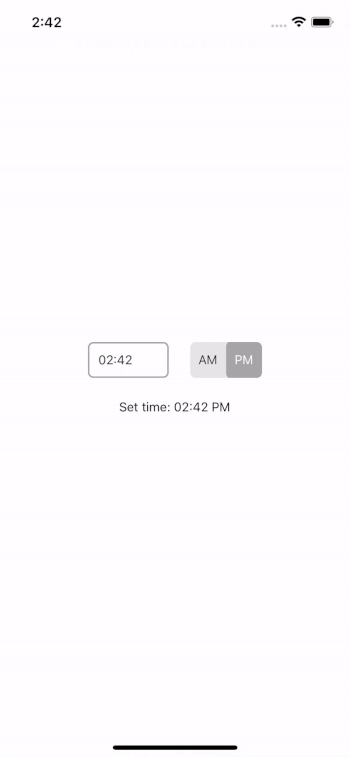

# React Native Time Input 🕓

This package works on both **Android** and **iOS**

## Preview



## Try it out

You can run the example module by performing these steps:

```
$ git clone git@github.com:tighten/react-native-time-input.git
$ yarn
$ yarn example start
```

## Installation

You can install this package by running one of the following  commands:

**NPM**

`npm i @tighten/react-native-time-input`

**Yarn**

`yarn add @tighten/react-native-time-input`

### Usage

```js
import React, { useState } from 'react';
import { Text, View } from 'react-native';
import TimeInput from '@tighten/react-native-time-input';

const MyApp = () => {
  const [time, setTime] = useState('');

  const handleTimeChange = (time, validTime) => {
    if (!validTime) return;

    setTime(time);
  }

  return (
    <View>
      <TimeInput 
        setCurrentTime 
        onTimeChange={handleTimeChange} 
      />

      <Text>Current time entered is: {time}</Text>
    </View>
  );
}

export default MyApp;
```

## Props

| Prop         | Default     | Type        | Description |
| ------------ | ----------- | ----------- | ----------- |
| `theme` |  | `TimeInputTheme` | See the [customization](#customization) section below for configuration instructions |
| `styles` |  | `TimeInputStyle` | See the [customization](#customization) section below for configuration instructions |
| `errorText` | "Please enter a valid time." | string | The message that is displayed when the user enters an invalid time.  |
| `initialTime` | `null` | Date | Optionally set the initial time for the input on first render. |
| `setCurrentTime` | `false` | boolean | Decide if the input should load with the user's current time set as it's value. This prop is ignored when an `initialTime` is passed in. |
| `onTimeChange` | `(localeTime, isValid) => {}` | function | A callback function that runs when the value of the time input or meridiem is changed. Receives a locale time string (`hh:mm a`) and a boolean value specifying if the time is valid. |

## Customization

The look and feel of this component is completely customizable.

### Theme

You can implement minimal changes to the look and feel by adjusting the default theme's color values for elements inside the component. Hex color codes and named color text strings (e.g., blue) are valid values. 
Here's what's available:

| Prop        | Default    |
| ----------- | ----------- |
| `errorTextColor`| `#c0392b` |
| `inputBackgroundColor`   | `#ffffff` |
| `inputBorderColor`   | `#a6a6a6` |
| `inputTextColor`   | `#2e2e2e` |
| `toggleBackgroundColor` | `#e6e6e6` |
| `toggleButtonActiveBackgroundColor` | `#a6a6a6` |
| `toggleButtonActiveTextColor` | `#ffffff` |
| `toggleButtonBackgroundColor` | `#e6e6e6` |
| `toggleButtonTextColor` | `#2e2e2e` |

**Example**

```js
import React from 'react';
import TimeInput from '@tighten/react-native-time-input';

export const MyApp = () => {
  return (
    <TimeInput 
      theme={{
        inputBackgroundColor: '#000000',
        inputTextColor: '#ffff00',
      }} 
    />
  )
};
```

### Styles

> Note: Theme overrides take precedent over all other styles.

If you want to make adjustments to the component's layout, you can pass in a style object to override the default styles.

| Prop        | Description |
| ----------- | ----------- |
| `componentContainer`| A wrapper `View` element that surrounds all elements in the component |
| `container`   | A wrapper `View` element that surrounds the text input and meridiem toggle |
| `input`   | The `TextInput` field |
| `toggle`   | A wrapper `View` element that surrounds the meridiem toggle and buttons |
| `toggleButton` | The `TouchableOpacity` (iOS) or `TouchableNativeFeedback` (Android) element for AM and PM |
| `toggleButtonActive` | An `Animated.View` element |
| `errorText` | The `Text` field displayed below the input when there are errors |

**Example**

```js
import React from 'react';
import TimeInput from '@tighten/react-native-time-input';

export const MyApp = () => {
  return (
    <TimeInput 
      styles={{
        componentContainer: {
          borderStyle: 'solid',
          borderWidth: 2,
          paddingHorizontal: 20,
        },
      }} 
    />
  )
};
```

## Contributing

See the [contributing guide](CONTRIBUTING.md) to learn how to contribute to the repository and the development workflow.

## License

MIT
